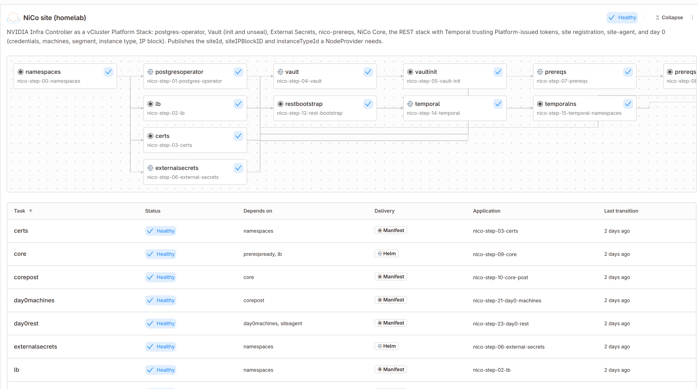

# NiCo as a Platform Stack

NVIDIA Infra Controller (NiCo, `NVIDIA/infra-controller` v2.1.0-rc.8) installed by two Platform
StackTemplates instead of NVIDIA's 16-phase shell installer. `nico-site` stands up a zero-DPU FLAT
site in 19 tasks, from postgres-operator to machines attached to an instance type. `nico-platform`
turns its published outputs into a NodeProvider, OSImage, Tenant and NetworkEnvironment. Deleting the
StackInstance is the uninstall.

Validated 2026-09-10/11 on Platform 4.13.0-alpha.10: NodeClaim available 6 min after creation. Site install takes about 15 min, mostly NiCo ingesting the machines; teardown about 5 min.



## Layout

| Path | What |
| --- | --- |
| `apps/` | 20 catalog `App`s, one per step (`nico-step-NN-*`): charts, manifests, or a manifests-wrapped hook Job |
| `stacktemplates/` | `nico-site` (parameters, DAG, outputs `siteId` `siteIPBlockID` `instanceTypeId`), `nico-platform` |
| `instances/` | example StackInstances with RFC 5737 addresses; copy and fill in |
| `examples/nodeclaim.yaml` | a claim against the site; never part of a stack |
| `hook-image/` | `alpine/k8s` + openssl, ssh-keygen, psql for the hook Jobs |
| `scripts/` | `push-charts.sh`, `render-test.sh` (offline helm render of every App), `status.sh`, `roundtrip.sh` |

## Use

```
export REGISTRY=oci://registry.example.com/nico      # your OCI project
make charts NICO_SRC=/path/to/infra-controller        # once per NiCo version: 5 charts + hook image
cp instances/example-nico-site.yaml instances/site-local.yaml && edit   # SITE=... below
make catalog validate install SITE=instances/site-local.yaml
make status
make platform PLATFORM=instances/platform-local.yaml  # fills the three ids from the site outputs
kubectl apply -f examples/nodeclaim.yaml
make uninstall-platform && make uninstall             # reverse dependency order
make clean-pvs                                        # Retain PVs the StorageClass kept
```

Destination cluster needs: cert-manager, a LoadBalancer implementation that pins IPs per Service
(Cilium LB-IPAM plus an L2 policy that excludes `nico-system`, or MetalLB, untested), a
Retain-capable StorageClass and the Platform itself on that cluster
(hook Jobs read `loft-cert` to mint provider tokens and apply management objects in-cluster).
The BMCs must be reachable from the cluster and PXE/DHCP VIPs from the machines; the machine
parameters assume the sushy-tools NiCo fork's MAC and serial conventions.

Retry a failed task: `kubectl annotate stackinstance -n <project> nico-site
platform.vcluster.com/stack-retry=<task|all>`. A parameter change redeploys only the tasks whose
child changed.

## How it is built

- **Every step is a catalog App, referenced by name.** The stack controller Go-templates inline
  task payloads, so helm syntax cannot live inline. Parameters are passed per task and land as
  `.Values.*` in the App.
- **Scripted steps are manifests Apps with their own Job, ServiceAccount and cluster-admin
  ClusterRoleBinding** (`post-install,post-upgrade` hook, `pre-delete` for cleanup). A `bash` App
  on a cluster destination only gets a namespaced RoleBinding. Same shape as the certified
  `restful-operation` App. Scripts are idempotent because hooks re-run on every upgrade.
- **Outputs thread the values that only exist at runtime**: Vault root token → prereqs chart, ESO-synced
  DB credentials → REST chart, site id → site-agent and day 0. A task may only read outputs from
  a namespace it deployed into, which is why prereqs-ready runs its release in `nico-rest`.
- **Uninstall is reverse-DAG helm uninstall plus pre-delete hooks** for what helm leaves: Vault and
  Postgres PVCs, the `nico-system` namespace (chart marks it keep), the prereqs chart's pre-install
  hook ClusterIssuers, the site CA, the tenant's project namespace, the Platform objects. CRDs stay.
- **NodeClaims are outside both stacks.** `nico-platform`'s teardown fails while any claim still
  references the provider rather than deleting it.

## Stack behaviours to know

- **Release names are `<task>-<hash>`.** Charts that hardcode their own names break: Vault
  (`vault-0.vault-internal`) and Temporal (`temporal-frontend.temporal`) need `fullnameOverride`.
  Helm adoption of pre-created objects is impossible, since the release name is unknowable.
- **The Platform pre-creates the release namespace** before helm runs. A chart that ships its own
  Namespace (prereqs owns `nico-system`) must release into another namespace.
- **`chart.repoURL` is not templated**; the registry is literal in the Apps and `make catalog`
  substitutes it.
- **Values are rendered with slim-sprig**: no `merge`, `dict` tricks or `until`.
- **Max 20 tasks per template.** Four steps here do two jobs each.
- **Editing a catalog App redeploys the instances that reference it** (the controller watches
  Apps and converges on the resolved config), and StackTemplate edits roll out on every reconcile.
  Deleting a child AppInstance to force a redeploy runs its pre-delete hooks, so prefer the retry
  annotation or an App edit. A failed first install is uninstalled before its retry.
- **Password parameters make every task error "withheld"** in the stack status. Read the child
  AppInstance's message or its gzip log secret `loft-appinstance-log-<child>`.
- **A templated `templateRef` name** (the certified Run:ai trick for conditional tasks) shows
  "not found" in the template view of the UI. Branch inside a manifests App instead.

## NiCo behaviours to know

- Site registration with a Platform-minted token needs `GET /infrastructure-provider/current`
  first on a fresh database (what the Platform driver calls); `/service-account/current` only
  materialises a provider for Keycloak service accounts.
- The REST API learns machine state from the site-agent's inventory publish, so day 0 waits
  10–15 min after nico-api reports Ready. Machines must be attached to the instance type before
  a tenant allocation can be satisfied; the day0rest task verifies the attachment.
- Integer pool ranges in the site config are quoted strings, or nico-api fails to load it.
- The Core chart expects a `forge-system` namespace it does not create.
- Temporal namespace registration lags `create` by minutes; verify with `describe`.
- Tear down a non-stack install with `helm uninstall`, not namespace deletion: cluster-scoped
  RBAC, CRDs and objects in cert-manager survive and fail helm's ownership checks later.
